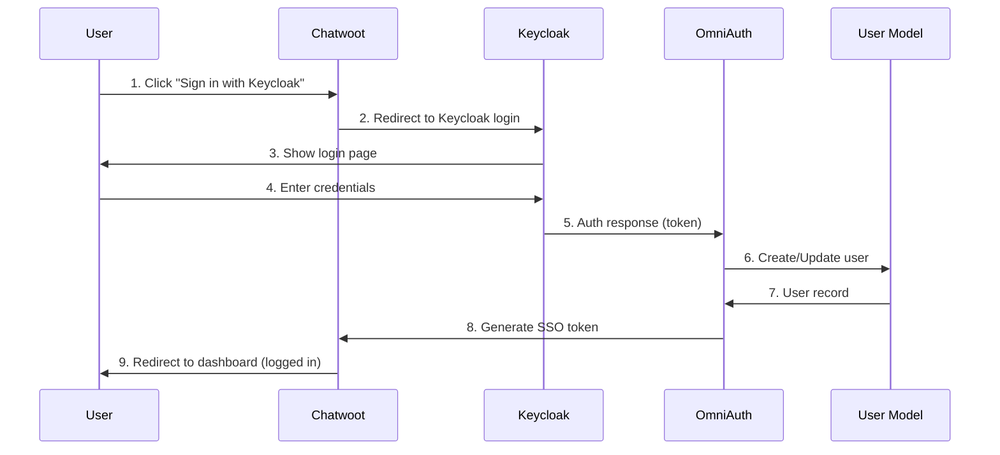

# Keycloak Authentication

Enterprise Single Sign-On (SSO) using Keycloak as an OpenID Connect (OIDC) identity provider for Chatwoot.

## 📋 Overview

The Keycloak integration enables enterprise-grade authentication for Chatwoot using OpenID Connect protocol. Users can log in to Chatwoot using their Keycloak credentials, providing seamless SSO across your organization's applications.

### Key Features

- ✅ **Single Sign-On (SSO)** - Users authenticate once with Keycloak
- ✅ **OpenID Connect** - Industry-standard OAuth 2.0 + identity layer
- ✅ **Per-Account Configuration** - Each Chatwoot account can have its own Keycloak settings
- ✅ **UI Configuration** - Configure via Chatwoot UI or environment variables
- ✅ **Encrypted Secrets** - Client secrets stored with Rails 7 encryption
- ✅ **Multi-Tenant Support** - Multiple Keycloak instances supported
- ✅ **Connection Testing** - Validate configuration before saving
- ✅ **Administrator Control** - Only admins can configure authentication
- ✅ **Automatic User Provisioning** - New users created automatically on first login

### Authentication Flow



**Flow Steps**:
1. User clicks "Sign in with Keycloak" button on Chatwoot login page
2. Chatwoot redirects to Keycloak authentication endpoint
3. Keycloak displays login page to user
4. User enters Keycloak credentials (username/password)
5. Keycloak validates credentials and sends auth response to OmniAuth callback
6. OmniAuth creates new user or updates existing user in database
7. User record returned with profile information
8. Chatwoot generates SSO session token
9. User redirected to Chatwoot dashboard, fully authenticated

## 🚀 Quick Start

See [[Keycloak Setup Guide]] for detailed step-by-step instructions.

### Prerequisites

- **Keycloak Instance**: Keycloak 18.0+ running and accessible
- **Realm**: A Keycloak realm for Chatwoot users
- **Admin Access**: Ability to create and configure clients in Keycloak
- **HTTPS**: Required for production (Keycloak enforces HTTPS for OIDC)

### Basic Setup

#### 1. Configure Keycloak

1. Create OpenID Connect client in Keycloak
2. Set valid redirect URI: `https://your-chatwoot.com/omniauth/keycloak/callback`
3. Get Client ID and Client Secret

#### 2. Configure Chatwoot

**Option A: Environment Variables** (Simple, single-tenant)

```bash
KEYCLOAK_ENABLED=true
KEYCLOAK_ISSUER=https://keycloak.example.com/realms/chatwoot
KEYCLOAK_CLIENT_ID=chatwoot
KEYCLOAK_CLIENT_SECRET=your-secret
FRONTEND_URL=https://your-chatwoot.com
```

**Option B: UI Configuration** (Recommended, multi-tenant)

1. Log in as administrator
2. Go to **Settings → Integrations → Keycloak**
3. Fill in configuration
4. Test connection
5. Save

#### 3. Test Login

1. Go to Chatwoot login page
2. Click "Sign in with Keycloak"
3. Enter Keycloak credentials
4. Redirected back to Chatwoot, logged in

## 📖 Configuration Guide

### Option 1: Environment Variables

Best for single-tenant installations where all accounts use the same Keycloak instance.

**Required Variables**:

| Variable | Description | Example |
|----------|-------------|---------|
| `KEYCLOAK_ENABLED` | Enable Keycloak authentication | `true` |
| `KEYCLOAK_ISSUER` | Keycloak realm issuer URL | `https://keycloak.example.com/realms/chatwoot` |
| `KEYCLOAK_CLIENT_ID` | Client ID from Keycloak | `chatwoot` |
| `KEYCLOAK_CLIENT_SECRET` | Client secret from Keycloak | `abc123...` |
| `FRONTEND_URL` | Chatwoot frontend URL | `https://chat.example.com` |

**Optional Variables**:

| Variable | Description | Default |
|----------|-------------|---------|
| `KEYCLOAK_SCOPES` | OIDC scopes (space-separated) | `openid profile email` |
| `KEYCLOAK_UID_FIELD` | User ID field from Keycloak | `preferred_username` |

**Example `.env` Configuration**:

```bash
# Enable Keycloak
KEYCLOAK_ENABLED=true

# Keycloak Realm URL
KEYCLOAK_ISSUER=https://keycloak.example.com/realms/chatwoot

# Client Credentials
KEYCLOAK_CLIENT_ID=chatwoot
KEYCLOAK_CLIENT_SECRET=1a2b3c4d-5e6f-7g8h-9i0j-k1l2m3n4o5p6

# Chatwoot URL
FRONTEND_URL=https://chatwoot.example.com

# Optional Customization
KEYCLOAK_UID_FIELD=email
KEYCLOAK_SCOPES=openid profile email
```

**After Configuration**:

```bash
# Restart Chatwoot
docker-compose restart  # Docker
# OR
overmind restart        # Development
```

### Option 2: UI Configuration

Best for multi-tenant installations where each account needs its own Keycloak instance.

#### Access Settings

1. Log in to Chatwoot as **Administrator**
2. Navigate to **Settings → Integrations**
3. Find **Keycloak** section
4. Click **Configure**

#### Configuration Fields

| Field | Required | Description | Example |
|-------|----------|-------------|---------|
| **Enable Keycloak** | Yes | Toggle to enable/disable | ✓ Checked |
| **Issuer URL** | Yes | Keycloak realm URL | `https://keycloak.example.com/realms/chatwoot` |
| **Client ID** | Yes | From Keycloak client settings | `chatwoot` |
| **Client Secret** | Yes | From Keycloak credentials | `abc123...` |
| **UID Field** | No | User identifier field | `preferred_username` |
| **Scopes** | No | OIDC scopes | `openid profile email` |

#### Test Connection

Before saving:

1. Click **Test Connection** button
2. System verifies:
   - Issuer URL is accessible
   - OIDC discovery endpoint responds
   - Configuration is valid
3. Shows success/failure message

#### Save Configuration

1. Click **Save** or **Update**
2. Configuration is encrypted and stored in database
3. OmniAuth middleware reloads automatically
4. Keycloak login option appears on login page

#### Retrieve Callback URL

After saving, the UI displays:

- **Redirect URI**: `https://your-chatwoot.com/omniauth/keycloak_{account_id}/callback`
- **Discovery URL**: `https://keycloak.example.com/realms/chatwoot/.well-known/openid-configuration`

**Important**: Copy the **Redirect URI** and add it to Keycloak's **Valid redirect URIs** list.

### Option 3: API Configuration

For automation or programmatic configuration.

#### Get Current Settings

```bash
curl -X GET https://chatwoot.example.com/api/v1/accounts/{account_id}/keycloak_settings \
  -H "api_access_token: YOUR_API_TOKEN"
```

#### Create/Update Settings

```bash
curl -X PUT https://chatwoot.example.com/api/v1/accounts/{account_id}/keycloak_settings \
  -H "api_access_token: YOUR_API_TOKEN" \
  -H "Content-Type: application/json" \
  -d '{
    "keycloak_settings": {
      "enabled": true,
      "issuer": "https://keycloak.example.com/realms/chatwoot",
      "client_id": "chatwoot",
      "client_secret": "your-secret",
      "uid_field": "preferred_username",
      "scopes": "openid profile email"
    }
  }'
```

#### Test Connection

```bash
curl -X POST https://chatwoot.example.com/api/v1/accounts/{account_id}/keycloak_settings/test \
  -H "api_access_token: YOUR_API_TOKEN"
```

#### Delete Settings

```bash
curl -X DELETE https://chatwoot.example.com/api/v1/accounts/{account_id}/keycloak_settings \
  -H "api_access_token: YOUR_API_TOKEN"
```

### Configuration Comparison

| Feature | Environment Variables | UI Configuration | API Configuration |
|---------|----------------------|------------------|-------------------|
| **Setup Complexity** | Low | Medium | High |
| **Multi-Tenant** | No (global) | Yes (per-account) | Yes (per-account) |
| **Dynamic Updates** | No (requires restart) | Yes (immediate) | Yes (immediate) |
| **Secret Encryption** | No | Yes | Yes |
| **Admin UI** | No | Yes | No |
| **Automation** | Deployment scripts | Manual | CI/CD pipelines |
| **Use Case** | Single-tenant, simple | Multi-tenant, user-friendly | Automation, bulk setup |

**Can Use Both**: Environment variables and UI configuration can coexist. Users will see multiple Keycloak login options if both are enabled.

## 🔧 User Provisioning

### New User Flow

When a user logs in via Keycloak for the first time:

1. **User Lookup**: Chatwoot searches for existing user by email
2. **User Creation** (if not found):
   - Email from OIDC token
   - Name from OIDC profile
   - Username from `preferred_username` or `uid_field`
   - Auto-confirmed (skips email verification)
3. **SSO Token**: Generated for seamless login
4. **Redirect**: User redirected to Chatwoot dashboard

### Existing User Flow

When an existing user logs in via Keycloak:

1. **User Lookup**: Found by email
2. **Profile Update**: Name/email updated if changed in Keycloak
3. **SSO Token**: Generated
4. **Redirect**: User redirected to dashboard

### User Attributes Mapping

| Keycloak | Chatwoot | Notes |
|----------|----------|-------|
| `email` | `email` | Primary identifier |
| `given_name` + `family_name` | `name` | Combined for full name |
| `preferred_username` | `username` | If available |
| `email_verified` | Auto-confirmed | Skips email verification |

## 🔒 Security

### Encrypted Storage

- Client secrets encrypted with Rails 7 `encrypts` feature
- Encryption key from Rails master key
- Secrets never exposed in API responses

### HTTPS Requirements

Keycloak enforces HTTPS for OIDC in production:

- Development: HTTP allowed (localhost)
- Production: HTTPS required

### Token Security

- Session tokens short-lived
- Refresh tokens supported (if enabled in Keycloak)
- No tokens stored in localStorage (server-side sessions)

### Access Control

- Only administrators can configure Keycloak settings
- Enforced via Pundit policy
- API access requires admin API token

## 🧩 Architecture

### Components

1. **OmniAuth Middleware**: Handles OIDC protocol
2. **Keycloak Provider**: Configured in `config/initializers/omniauth.rb`
   - Supports both environment variables and database-driven configuration
   - Loads enabled providers dynamically at startup
3. **KeycloakSetting Model**: `app/models/keycloak_setting.rb`
   - Stores per-account Keycloak configuration
   - Encrypts client secrets using Rails 7 encryption
4. **Keycloak Settings Controller**: `app/controllers/api/v1/accounts/keycloak_settings_controller.rb`
   - REST API for CRUD operations
   - Administrator-only access via Pundit policy
5. **Callbacks Controller**: `app/controllers/devise_overrides/omniauth_callbacks_controller.rb`
6. **User Model**: `app/models/user.rb` (includes `:keycloak` provider)

### Code Structure

```
app/
├── controllers/
│   └── api/v1/accounts/
│       └── keycloak_settings_controller.rb  # API endpoints
├── models/
│   ├── keycloak_setting.rb                  # Settings model
│   └── user.rb                               # Provider registration
├── policies/
│   └── keycloak_setting_policy.rb           # Authorization
├── views/
│   └── api/v1/
│       ├── accounts/keycloak_settings/
│       │   └── show.json.jbuilder
│       └── models/
│           └── _keycloak_setting.json.jbuilder
config/
├── initializers/
│   └── omniauth.rb                           # Provider configuration
└── routes.rb                                 # API routes
db/
└── migrate/
    └── 20251105213911_create_keycloak_settings.rb
```

## 📚 Additional Resources

- [[Keycloak Setup Guide]] - Step-by-step configuration
- [Keycloak Documentation](https://www.keycloak.org/documentation)
- [OpenID Connect Specification](https://openid.net/connect/)
- [OmniAuth OpenID Connect](https://github.com/omniauth/omniauth_openid_connect)

## 🐛 Known Issues

1. **Multiple Login Options**: If both environment variables and UI configuration are enabled, users see multiple Keycloak buttons
2. **Realm Changes**: Changing Keycloak realm requires updating all client redirect URIs
3. **User Email**: Users MUST have email in Keycloak for Chatwoot login

## 🔄 Version History

| Version | Date | Changes |
|---------|------|---------|
| 1.0.0 | 2025-11-05 | Initial release with UI configuration support |

---

**Need Help?** See [[Keycloak Setup Guide]] or create an issue on [GitHub](https://github.com/kennis-ai/chatwoot/issues).
